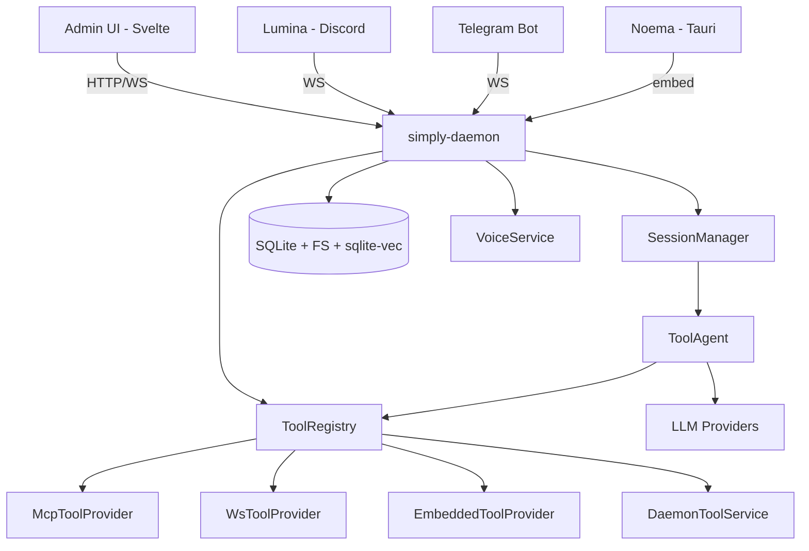
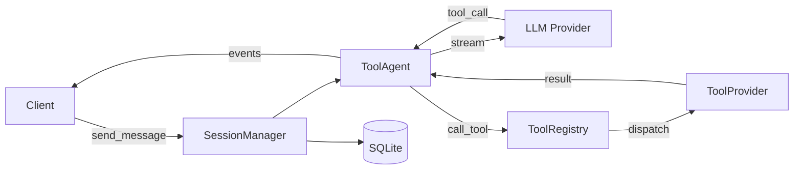

# Simply

**Problem:** Lumina (Discord bot) and Noema (desktop AI assistant) needed the same capabilities — LLM orchestration, MCP tools, voice, storage — but were separate codebases. Unifying them into a shared daemon eliminates duplication and lets all clients share tools, knowledge, and automation.

**Current focus:** Events & Intents phase — reactive event bus, scheduled actions, LLM-compiled intents. Content & RAG, unified tool dispatch, and admin UI are complete.

**Notes:** The project uses `jj` (Jujutsu) for version control, not git directly. Never run `cargo build/test` — the user handles that. Skills (like GDocsSkill) are registered by clients (Lumina), not hardcoded in the daemon.

---

## Architecture

### Overview

Simply is a unified AI platform where a central daemon (`simply-daemon`) provides LLM sessions, tool dispatch, storage, voice, and search. Clients (Discord bot, desktop app, web admin UI) connect via REST/WS or embed the daemon in-process. All tool sources — MCP servers, WebSocket clients, embedded skills — implement a single `ToolProvider` trait and are dispatched identically.

### Key Concepts

| Concept | Description |
|---------|-------------|
| `ToolProvider` | Unified trait for anything providing tools (MCP, WS, skills). Speaks rmcp types. |
| `ToolRegistry` | Central dispatcher holding `Vec<Arc<dyn ToolProvider>>` + daemon REST tools |
| `Skill` | In-process tool provider taking `Arc<dyn Daemon>` for API access |
| `RequestContext` | Per-request scope with user identity + OAuth tokens |
| UCM | Three-layer storage: Addressable (entities) → Structure (conversations, documents) → Content (immutable text + blobs) |
| `#[rpc_service]` | Proc macro generating REST dispatch + WS client from trait definitions |

### Structure

```
noema/
├── simply-core/           # LLM providers, MCP, agent, storage traits
│   └── llm/               # Multi-provider LLM (Claude, OpenAI, Gemini, Mistral, Ollama)
├── simply-daemon/
│   ├── api/               # API traits: Daemon, ToolProvider, Skill, RemoteDaemon
│   ├── src/services/      # registry.rs, providers.rs, tools.rs, model, document, search...
│   ├── src/builder.rs     # DaemonBuilder — wires all services
│   ├── src/embedded.rs    # EmbeddedDaemon (in-process)
│   ├── src/net/           # REST + WS server, auth, admin API
│   └── admin/             # Astro + Svelte 5 web UI
├── simply-rpc/            # RPC framework, #[rpc_service] macro
├── simply-voice/          # STT/TTS providers (Voxtral, Whisper, ElevenLabs, Gemini)
├── lumina/                # Discord bot (serenity + songbird)
├── telegram-bot/          # Telegram bot (long polling + daemon sessions)
├── mcp-gdocs/             # Google Docs skill + MCP server
├── noema/                 # Tauri desktop shell
├── commands/              # Command framework
└── config/                # Settings, encrypted credentials
```

### Component Graph



### Components

#### simply-daemon (hub)
**Purpose**: Central service — sessions, storage, tool dispatch, REST/WS server, admin UI
**Key files**: `src/builder.rs` — wiring, `src/embedded.rs` — in-process impl, `src/services/registry.rs` — ToolRegistry
**Exposes**: `Daemon` trait, REST + WS API, admin UI at `/admin/`

#### simply-daemon-api (shared types)
**Purpose**: API traits and types shared by daemon, skills, and clients
**Key files**: `api/src/lib.rs` — Daemon trait, `api/src/provider.rs` — ToolProvider, `api/src/skill.rs` — Skill + OAuthRequirement
**Exposes**: `Daemon`, `ToolProvider`, `Skill`, `RemoteDaemon` (skills receive `simply_rpc::RequestContext` directly)

#### simply-core (internal library)
**Purpose**: LLM abstraction, MCP client, agent orchestration, storage traits
**Key files**: `src/agent/` — ToolAgent, `src/mcp/` — McpRegistry, `llm/src/` — providers
**Exposes**: `ToolService`, `SessionManager`, `ChatModel`, `McpRegistry`

#### simply-rpc (transport)
**Purpose**: RPC framework with proc macro for REST + WS dispatch
**Key files**: `src/lib.rs` — ServiceRouter, `macros/` — `#[rpc_service]` proc macro
**Exposes**: `#[rpc_service]`, `ServiceRouter`, `RequestContext`, `RestService`

### Data Flow



### Conventions

- `#[rpc_service("prefix")]` on API traits generates REST routes + WS dispatch
- Binary uploads via query params, standard HTTP semantics
- OAuth tokens flow through `RequestContext.tokens`, never as explicit params
- Skills declare `OAuthRequirement`s; daemon handles auth flows
- All tool providers speak `rmcp::model` types (Tool, CallToolResult)
